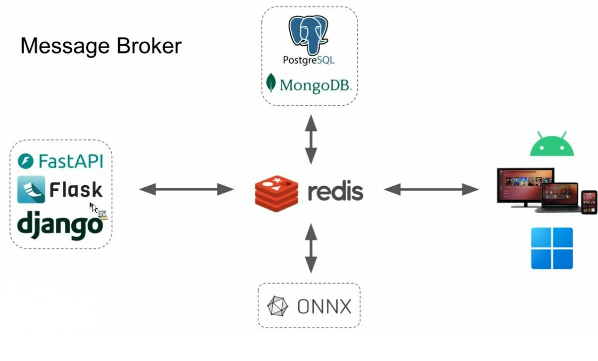

# Redis (NoSQL, use key-values like mongoDB)

## USAGE : 
for saving TEMPORAY data , which there is no need to save them forever .

### used for data that should be updated and be saved simultaneously.

<br>

Redis is on RAM (cache database), and SQL database is on hard disk  , while a program is running . <br>

if the required user data which is REQUESTED to the server, have not been found on RAM (Redis Cache), then server should read requested data from main database . here , after reading data from main DB , a copy of that readed data will be saved into REDIS CACHE . then it will be returned from server into user .


<br>

+ 1- it is a ```temporary DB``` : it means that data will be save on RAM : <br>
like temporary data while using that special application . 
using from RAM , can cost 
+  2- Therefore , we need ```speed``` factor for updating temporary data while using the app . Response time will vary depending on using redis or not . 

+ 3- Use redis for caching data . Because its faster than RAM & disk .

+ 4-In Deployment , redis can work as a intermediary between backend (flask,django,fastapi) and DBs (like postgres & Mongo) . <br>
it will recieve data from DB and AI model (ONNX) , then give them to backend , and backend will send them into frontend . <br>

### Here , Redis works like a postman , if the client was offline (could'nt receive the response from server), IT will save the DATA which has came from Backend .




+ we use redis if we want to send data in a continues ways , or in ```stream processing``` . like license plate reader , which is sending many images at a time .
here , captured images are sending to the backend so quickly , but for our AI model it's not possible to process data and does recognition task so quickly . therefore , redis will read the frames and store them for slower processes .


+ distributed locking :
we used to use async & await for async functions . but it was used in just a unique program . hence , in above diagram , with multiple programs & MICROSERVICES we cant use async-await method , so we choose redis for that ASYNCHRONOUS purpose .


# useful links :
https://redis.io/docs/latest/develop/connect/clients/python/


# how to run :
```
docker pull redis
```

```
docker run --name myredis -p 6379:6379 -d redis
```
```
docker exec -it myredis redis-cli
```
```
CONFIG GET databases
```
This will show how many databases are configured for the Redis instance. By default, Redis has 16 databases, indexed from 0 to 15.

```
SELECT 0
```
```
KEYS *
```